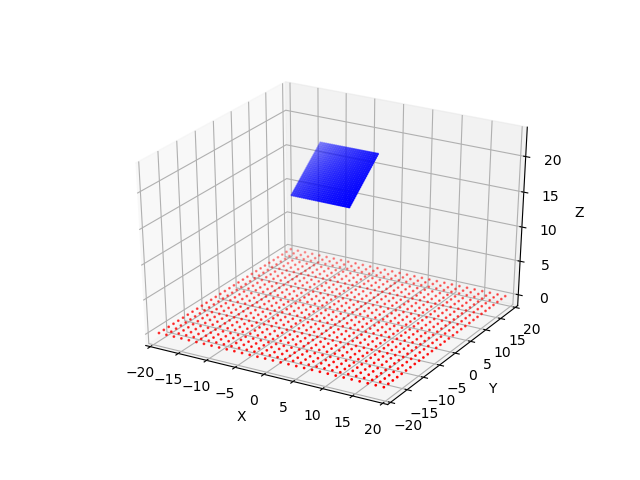

# Calculation of irradiance of the platform

The task was carried out in the 3'rd variant: 
calculation os irradiance of the platform, illuminated with flat lambert light source.

The platform with side `side_plat` is located in the plane `XY`.
The center of square lambert light source with side `side_light`
 is located at point `(0, 0, side_plat/2)` and titled at the angle `angle_light`
 by axis about the axis `Y` upwards. The square light source is divided on `n_light * n_light` 
 squares, thr platform is divided on `n_plat * n_plat` squares and  after calculation of irradiance
 will performs in every platform cell. 
 
 Output: the result of calculation is saved to 
 `output_dir/irradiance.txt`, visualization to `output_dir/irradiance.png` and scene to `output_dir/scene.png`
 
 
 
 # Prerequirement
 
 * python3.5
 * numpy
 * matplotlib.pyplot
 * pandas
 
 # Usage
 ```angular2html
python3 compute_irradiance.py [-h] [--F F] [--side_plat SIDE_PLAT] [--side_light SIDE_LIGHT]
       [--angle_light ANGLE_LIGHT] [--n_plat N_PLAT] [--n_light N_LIGHT]
       [--path_V_lambda PATH_V_LAMBDA] [--path_RSPD PATH_RSPD]
       [--output_dir OUTPUT_DIR]

arguments:
  -h, --help            show this help message and exit
  --F F                 Total radiant flux (Watt)
  --side_plat SIDE_PLAT
                        Size of platform side (meter)
  --side_light SIDE_LIGHT
                        Size of light source side (meter)
  --angle_light ANGLE_LIGHT
                        Angle of inclination of the light source (degree)
  --n_plat N_PLAT       Number of cells of platform
  --n_light N_LIGHT     Number of cells of light source
  --path_V_lambda PATH_V_LAMBDA
                        Path to V(lambda) curve
  --path_RSPD PATH_RSPD
                        Path to relative SPD
  --output_dir OUTPUT_DIR
                        Path directory to save results

```

## example:

```angular2html
python3 compute_irradiance.py \
    --F 23.2 \
    --side_plat 40 \
    --side_light 10 \
    --angle_light 30 \
    --n_plat 30 \
    --n_light 30 \
    --path_V_lambda ../data/linCIE2008v2e_5.xls \
    --path_RSPD ../data/D65.xls \
    --output_dir ../example_calculation
```
 

 